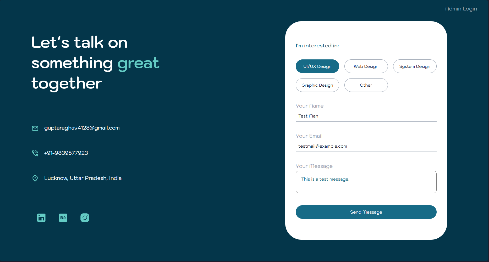
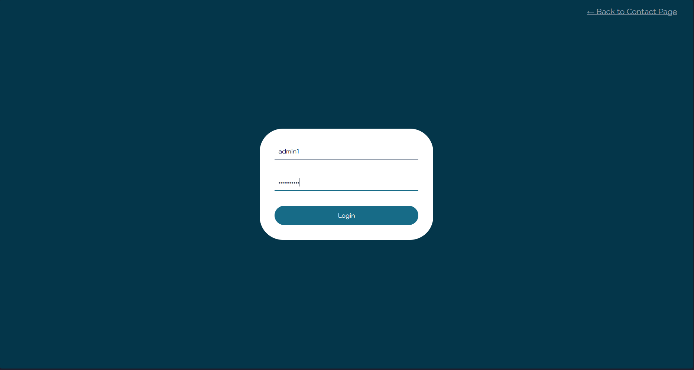
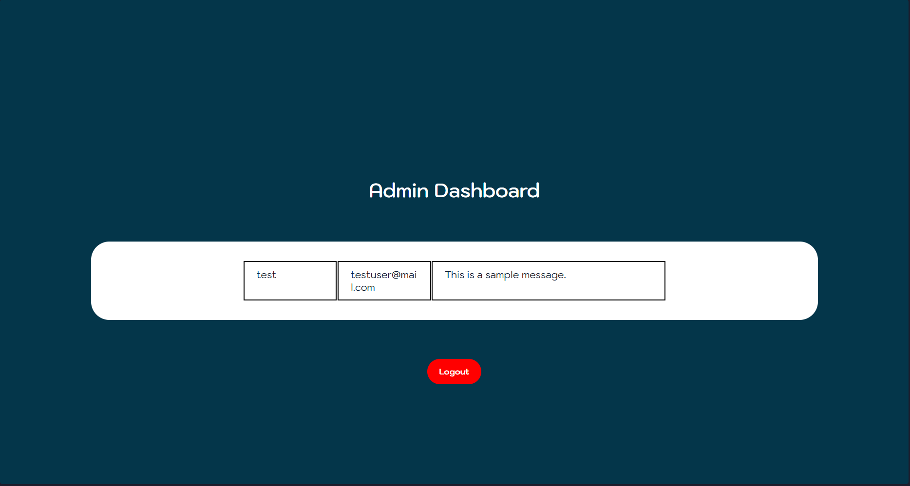

# Contact Management System

A full-stack contact and lead management system with admin authentication and a protected dashboard.

This project simulates a real-world business contact pipeline where users can submit inquiries and an admin can securely view and manage all submissions.

---

## 🚀 Features

- Contact form with client-side & server-side validation
- MongoDB data persistence
- Admin authentication using JWT
- Protected admin dashboard
- Responsive UI
- Clean separation of frontend and backend

---

## 📸 Screenshots

### Contact Page

### Admin Login

### Admin Dashboard

## 🛠 Tech Stack

### Frontend

- HTML
- CSS
- Vanilla JavaScript

### Backend

- Node.js
- Express.js
- MongoDB (Mongoose)
- JWT Authentication

### Deployment

- Frontend: Netlify / Vercel
- Backend: Render / Railway
- Database: MongoDB Atlas

---

## 📂 Project Structure

contact-management-system/

├── frontend/

├── backend/

└── README.md

---

## 🌐 Live Demo

- **Frontend:** <https://contact-management-system-rago.netlify.app/index.html>
- **Admin Dashboard:**  <https://contact-management-system-rago.netlify.app/pages/admin-login>

> Admin credentials are required to access the dashboard.

## 🔐 Admin Demo Access

Use the following credentials to access the admin dashboard:

- **Username:** demoadmin
- **Password:** demopassword

---

## 🧠 Architecture Overview

Client (Browser)

↓

Frontend (HTML/CSS/JS)

↓

API (Express)

↓

Controllers

↓

MongoDB

---

## 📌 Why This Project Matters

This project demonstrates:

- Full-stack development skills
- Backend API design
- Authentication & authorization
- Realistic business use-case implementation
- Deployment experience

---

## 👤 Author

**Raghav**  
